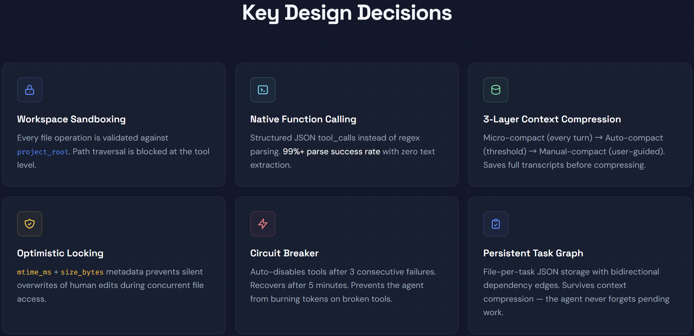
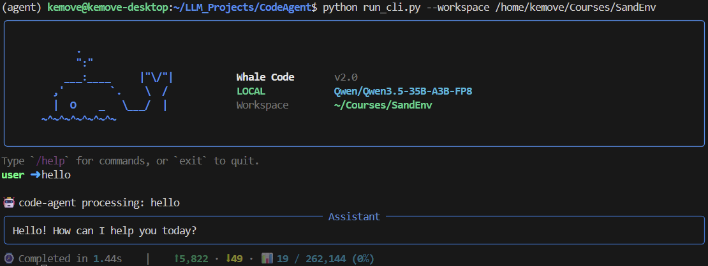
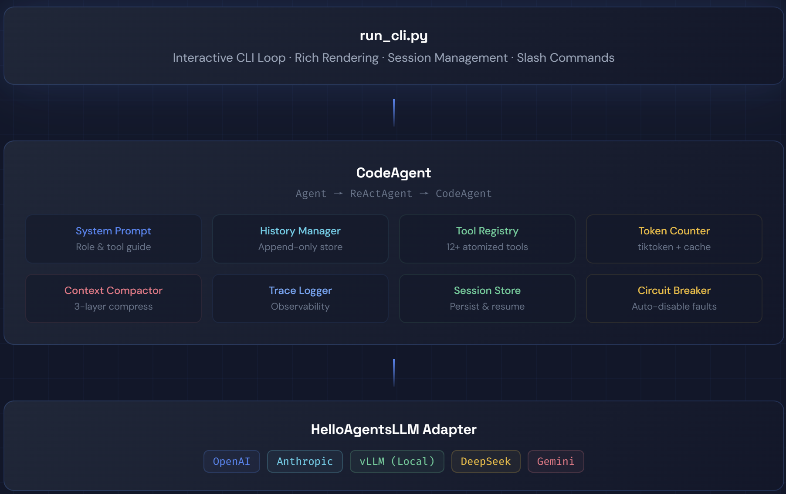

# Whale Code — A Production-Grade Coding Agent Framework

Whale Code is a from-scratch implementation of an autonomous coding agent that operates inside a local repository. It follows the **ReAct (Reasoning + Acting)** paradigm, powered by OpenAI-compatible function calling, and ships with a full suite of atomized programming tools, a multi-layer context management engine, and a persistent task scheduling system. The goal is to replicate — and deeply understand — the core architecture behind tools like Claude Code, Cursor Agent, and similar AI coding assistants.



## Table of Contents
- [Quick Start](#quick-start)
- [Architecture Overview](#architecture-overview)
- [CodeAgent Implementation Details](#codeagent-implementation-details)
- [Context Management](#context-management)
- [Atomized Tool System](#atomized-tool-system)
  - [Why Atomized Tools Instead of Bash?](#why-atomized-tools-instead-of-bash)
  - [Tool List](#tool-list)
  - [Tool Response Protocol](#tool-response-protocol)
  - [Circuit Breaker](#circuit-breaker)
- [Task System](#task-system)
  - [Persistent Task Graph (TaskTool)](#persistent-task-graph-tasktool)
  - [Lightweight Progress Tracking (TodoWrite)](#lightweight-progress-tracking-todowrite)
  - [Background Execution (BackgroundTool)](#background-execution-backgroundtool)
- [License](#license)

---

## Quick Start

### Installation

```bash
git clone https://github.com/ZenoAFfectionate/Coding_Agent.git
cd WhaleCode

# Create and activate a conda virtual environment
conda create -n agent python=3.12 -y
conda activate agent

# Install dependencies
pip install -r requirements.txt

# Configure your API key
cp .env.example .env   # then edit .env with your key
```

### Running the Agent

```bash
CUDA_VISIBLE_DEVICES=0 vllm serve Qwen/Qwen3.5-35B-A3B-FP8 \
    --port 8000 \
    --gpu-memory-utilization 0.90 \
    --reasoning-parser qwen3 \
    --enable-auto-tool-choice \
   --language-model-only \
    --tool-call-parser qwen3_coder
```

```bash
python run_cli.py --workspace /working/space
```

The CLI provides an interactive loop where you can issue coding tasks:

```
> Read the main entry point and summarize its structure
> Find all TODO comments in the codebase
> Add error handling to the data processing pipeline
```



### Slash Commands

| Command | Description |
|---------|-------------|
| `/help` | Show the help message with all available commands |
| `/info` `/model` | Display runtime info: workspace path, model, base URL, temperature, trace status, tool count |
| `/tools` | List all registered tools with their descriptions |
| `/pwd` | Print the current working directory |
| `/cd <path>` | Change the agent's working directory (must stay within workspace root) |
| `/history [n]` | Show conversation history; optional `n` limits to the last N entries |
| `/log` | Open all terminal output in a scrollable pager (`less`/`more`) |
| `/clear` | Clear the in-memory conversation history |
| `/save [name]` | Save the current session snapshot (default name: `session-latest`) |
| `/load [path\|name]` | Load a previously saved session by file path or name |
| `/sessions` | List all saved session files with metadata (steps, tokens, timestamps) |
| `/compact [focus]` | Manually trigger context compaction; optional `focus` guides the summary |

---

## Architecture Overview



The agent follows a strict **Think → Act → Observe → Re-think** loop implemented through the ReAct pattern. Every reasoning step, tool invocation, and observation is tracked, compressed, and persisted.

---

## CodeAgent Implementation Details

**Source**: `code/agents/code_agent.py`

`CodeAgent` is the top-level agent class, built by extending the inheritance chain:

```
Agent (base) → ReActAgent (function-calling ReAct loop) → CodeAgent (coding-specialized)
```

### Key Design Decisions

1. **Workspace Sandboxing**: The agent is initialized with a `project_root` and `working_dir`. Every file operation is validated to stay within the workspace root, preventing accidental access to system files.

2. **OpenAI Function Calling (not text-parsing)**: Unlike text-based ReAct implementations that rely on regex to parse `Action: ...` from model output, `CodeAgent` uses native function calling. The model's `tool_calls` are structured JSON, achieving a **99%+ parse success rate** with zero regex.

3. **Tool Auto-Registration**: On initialization, `register_default_tools()` instantiates and registers 12+ atomic tools, each bound to the workspace root:

   ```python
   def register_default_tools(self, enable_task_tool=True):
       self.tool_registry.register_tool(ReadTool(...))
       self.tool_registry.register_tool(WriteTool(...))
       self.tool_registry.register_tool(EditTool(...))
       self.tool_registry.register_tool(GlobTool(...))
       self.tool_registry.register_tool(GrepTool(...))
       self.tool_registry.register_tool(BashTool(...))
       self.tool_registry.register_tool(BackgroundTool(...))
       # ... and more
   ```

4. **Background Notification Injection**: Before each model call, `_before_model_call()` drains completed background task notifications and injects them as `<background-results>` messages, so the model is aware of async build/test results.

5. **Sub-Agent Creation**: `_create_subagent()` spawns an isolated `CodeAgent` with its own `ToolRegistry`, separate history, and `interactive=False` (disabling `AskUser`). This enables context-isolated delegated work.

6. **Manual Context Compaction**: The `compact()` method exposes a public API for on-demand context compression, reconstructing messages from history, running the compactor, and replacing the stored history.

---

## Context Management

Context management is the core engineering challenge of a long-running coding agent. Whale Code implements a **multi-layer context engineering system** with five dedicated components.

### 1. HistoryManager (`code/context/history.py`)

An append-only message store with round-based compression:

- **Append-only writes** — cache-friendly, no in-place edits.
- **Round boundary detection** — identifies `user → assistant/tool*` round boundaries to determine compression granularity.
- **Compression** — replaces old rounds with a summary message while retaining the most recent `min_retain_rounds` complete rounds.
- **Serialization** — `to_dict()` / `load_from_dict()` for session persistence.

### 2. TokenCounter (`code/context/token_counter.py`)

Local token estimation without API calls:

- **tiktoken integration** — uses the `cl100k_base` encoding for accurate counts.
- **Caching** — `role:content` cache key avoids re-encoding identical messages.
- **Incremental counting** — `_history_token_count` is updated on every `add_message()` call, never re-scanning full history.
- **Graceful degradation** — falls back to `len(text) // 4` when tiktoken is unavailable.

### 3. ContextCompactor (`code/context/compactor.py`)

A three-layer compression engine adapted for OpenAI function-calling message format:

| Layer | Trigger | Strategy |
|-------|---------|----------|
| **Layer 1: micro_compact** | Every turn | Scans `tool` role messages from newest to oldest; keeps the N most recent tool results intact, replaces older ones with `[Previous tool result: {name} — truncated]` |
| **Layer 2: auto_compact** | Token threshold exceeded | Saves the full transcript to a JSONL file, calls the LLM to generate a structured summary, rebuilds messages as `[system] + [summary] + [ack]` |
| **Layer 3: manual_compact** | User-triggered | Same as Layer 2, but accepts an optional `focus` parameter to guide the summary (e.g. "focus on the authentication module") |

The compactor builds a `tool_call_id → tool_name` mapping to produce meaningful truncation labels, and serializes messages with per-message truncation (2000 chars max) before feeding them to the summary LLM.

### 4. ObservationTruncator (`code/context/truncator.py`)

Handles tool output that is too large to fit in context:

- **Multi-directional truncation** — `head` (keep first N lines), `tail` (keep last N lines), or `head_tail` (keep both ends with a gap marker).
- **Dual limits** — enforces both `max_lines` (default 2000) and `max_bytes` (default 50KB).
- **Full output persistence** — saves the complete untruncated output as a JSON file in `tool-output/`, so the agent can reference it later if needed.

### 5. ContextBuilder (`code/context/builder.py`)

A **GSSC (Gather-Select-Structure-Compress)** pipeline for structured context assembly:

1. **Gather** — collects context packets from multiple sources (system instructions, conversation history, additional data).
2. **Select** — scores packets using `0.7 × relevance + 0.3 × recency` with exponential time decay, filters by `min_relevance` threshold, and fills within the token budget.
3. **Structure** — organizes selected packets into a template: `[Role & Policies] → [Task] → [State] → [Evidence] → [Context] → [Output]`.
4. **Compress** — if the structured result exceeds the token budget, truncates by paragraph boundaries.

---

## Atomized Tool System

### Why Atomized Tools Instead of Bash?

A naive approach would give the agent a single `Bash` tool and let it run `cat`, `grep`, `sed`, etc. for all operations. Whale Code intentionally **splits file and search operations into dedicated, atomic tools**. Here's why:

#### 1. Workspace Sandboxing

Every atomic tool (Read, Write, Edit, Glob, Grep) uses `resolve_path()` to validate that the target path stays within the `project_root`. The Bash tool cannot enforce this for arbitrary shell commands.

```python
# Every tool validates paths against the workspace root
target = resolve_path(self.project_root, self.working_dir, raw_path)
# Raises ValueError if the path escapes the workspace
```

#### 2. Optimistic Locking for Concurrent Safety

`ReadTool` returns `expected_mtime_ms` and `expected_size_bytes` metadata with every file read. `WriteTool` and `EditTool` accept these values back and check them before writing — if the file has been modified externally since it was last read, the write is rejected. This prevents the agent from silently overwriting human edits. A raw `Bash` + `sed`/`echo` pipeline has no such protection.

#### 3. Structured Response Protocol

Every tool returns a `ToolResponse` object with a three-state status (`SUCCESS | PARTIAL | ERROR`), structured `data` payload, `error_info` with error codes, and `stats` with timing information. This gives the agent machine-readable feedback instead of parsing unstructured stdout/stderr.

```python
class ToolResponse:
    status: ToolStatus        # SUCCESS / PARTIAL / ERROR
    text: str                 # Human/LLM-readable text
    data: Dict[str, Any]      # Structured payload
    error_info: Dict          # Error code + message
    stats: Dict               # Timing, token counts
```

#### 4. Circuit Breaker Protection

The `ToolRegistry` wraps every tool call with a `CircuitBreaker`. If a tool fails 3 consecutive times, it is automatically disabled for 5 minutes. This prevents infinite retry loops where the agent keeps calling a broken tool. Bash-only architectures have no such guardrail.

#### 5. Context Efficiency

Atomic tools produce compact, well-formatted output. `GlobTool` returns sorted file paths. `GrepTool` returns `file:line: content` entries. `ReadTool` returns numbered lines with metadata headers. Raw shell output from `find`, `grep -r`, or `cat` is often verbose, includes color codes, and wastes context tokens.

#### 6. The Bash Tool Actively Redirects

The `BashTool` itself enforces this philosophy. It maintains a `PREFER_SPECIALIZED_TOOLS` blocklist:

```python
PREFER_SPECIALIZED_TOOLS = {"ls", "cat", "grep", "rg", "find", "head", "tail"}
```

If the model tries to run `grep pattern .` or `cat file.py` as a standalone command, Bash returns an error saying "Use the dedicated tools instead." However, piped usage like `git log | grep fix` is allowed, since `grep` is not the segment leader.

### Tool List

| Category | Tool | Description |
|----------|------|-------------|
| **File Discovery** | `Glob` | Find files by glob pattern (`**/*.py`, `src/**/*.ts`) with `fnmatch` + directory pruning |
| | `Grep` | Regex code search using ripgrep (with Python fallback) |
| | `LS` | List directory contents |
| | `Read` | Read file content with metadata for optimistic locking |
| **File Modification** | `Write` | Full-file rewrite with atomic write + optimistic locking + dry-run mode |
| | `Edit` | Single-snippet surgical replacement with conflict detection + backup |
| | `MultiEdit` | Batch multiple independent edits in one file atomically |
| **Execution** | `Bash` | Shell commands with command policy validation (blocks interactive/destructive/privileged commands) |
| | `background_run` | Start long-running commands asynchronously |
| | `background_check` | Inspect background task status and output |
| | `background_cancel` | Cancel a running background task |
| **Planning** | `TodoWrite` | Lightweight declarative progress tracking |
| | `task_create` | Create a persistent task with dependency graph |
| | `task_update` | Update task status/fields/dependencies |
| | `task_list` / `task_get` | Query task status |
| **Web** | `WebSearch` | Search the web via DuckDuckGo |
| | `WebFetch` | Fetch and extract readable text from a URL |
| **Knowledge** | `Skill` | Load domain-specific skills on demand |
| **Interaction** | `AskUser` | Ask the user a question (main agent only, disabled in sub-agents) |

### Tool Response Protocol

All tools return `ToolResponse` with a three-state status:

- **`SUCCESS`** — task completed as expected.
- **`PARTIAL`** — result is usable but degraded (output truncated, search limit reached, non-zero exit code).
- **`ERROR`** — no valid result; includes a structured error code (e.g. `NOT_FOUND`, `ACCESS_DENIED`, `TIMEOUT`, `CIRCUIT_OPEN`).

### Circuit Breaker

```
Closed (normal) ──[3 consecutive failures]──► Open (disabled)
      ▲                                           │
      └───────────[5 min timeout]─────────────────┘
```

The circuit breaker tracks per-tool failure counts. When a tool hits the threshold, it's automatically disabled for 5 minutes. This prevents the agent from burning tokens on a broken tool.

---

## Task System

Whale Code implements three complementary mechanisms for multi-task scheduling, each serving a different purpose:

### Persistent Task Graph (TaskTool)

**Source**: `code/tools/builtin/task_tool.py`

A **file-per-task** persistent graph that survives context compression. This is the core mechanism for complex, multi-step work.

**Storage**: Each task is stored as an individual JSON file under `memory/tasks/task_{id}.json`.

**Data Model**:

```json
{
  "id": 1,
  "subject": "Implement user authentication",
  "description": "Add JWT-based auth to the API endpoints",
  "status": "in_progress",
  "blockedBy": [2],
  "blocks": [3, 4],
  "owner": "code-agent"
}
```

**Key Features**:

1. **Dependency Graph** — Tasks can declare `blockedBy` (prerequisites) and `blocks` (dependents) relationships. When a task is completed, its ID is automatically removed from all other tasks' `blockedBy` lists, unblocking dependent work.

2. **Bidirectional Edge Maintenance** — Adding `blockedBy: [2]` to task 1 automatically adds `blocks: [1]` to task 2.

3. **Context-Compression Resilience** — Because tasks are stored as files on disk (not in conversation history), they survive context compaction. Even after the conversation is summarized, the agent can query `task_list` to recall pending work.

4. **Expandable Tool Pattern** — `TaskTool` is registered as an `expandable=True` tool that auto-expands into 4 independent sub-tools via the `@tool_action` decorator:
   - `task_create` — Create a task with optional `blocked_by` dependencies.
   - `task_update` — Update status (`pending` → `in_progress` → `completed`), subject, description, owner, or dependencies.
   - `task_list` — List tasks with optional status filter.
   - `task_get` — Get full details of one task.

### Lightweight Progress Tracking (TodoWrite)

**Source**: `code/tools/builtin/todowrite_tool.py`

A **declarative, in-session** progress tracker for lightweight task management:

- **Declarative Override** — each call submits the full todo list; no incremental add/remove.
- **Single-Thread Enforcement** — at most 1 task can be `in_progress` at any time; the tool rejects lists with multiple active tasks.
- **Auto-Recap Generation** — generates a compact status line (e.g. `[2/5] In progress: xxx. Pending: yyy; zzz.`) for context efficiency.
- **Persistent Snapshots** — todo states are saved as timestamped JSON files under `memory/todos/`.

### Background Execution (BackgroundTool)

**Source**: `code/tools/builtin/background.py`

Enables **non-blocking parallel execution** of long-running commands:

1. **`background_run`** — spawns a shell command in a daemon thread. Returns immediately with a task ID so the agent can continue reasoning.

2. **Notification Injection** — The `BackgroundManager` maintains a notification queue. Before each model call, `CodeAgent._before_model_call()` drains completed notifications and injects them as `<background-results>` messages. The model learns about build/test outcomes without polling.

3. **Task Integration** — Background tasks can be linked to persistent tasks via `task_id`. If `complete_task_on_success=True`, the background manager automatically marks the linked task as `completed` when the command exits with code 0.

4. **Lifecycle Management** — `background_check` inspects status/output, `background_cancel` sends SIGTERM. Records are persisted as JSON files under `memory/background/` and survive process restarts (interrupted tasks are marked as `interrupted`).

---

## License

This project is licensed under [CC-BY-NC-SA-4.0](LICENSE).
