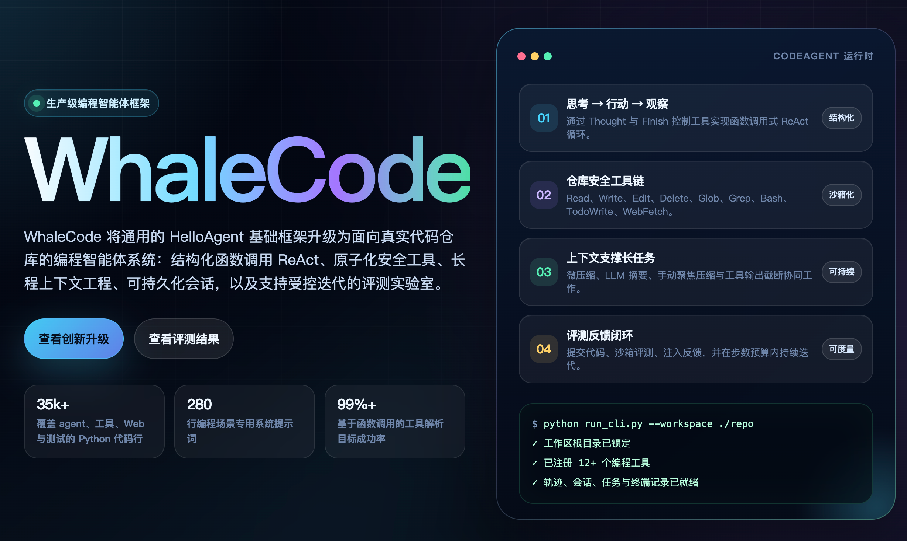
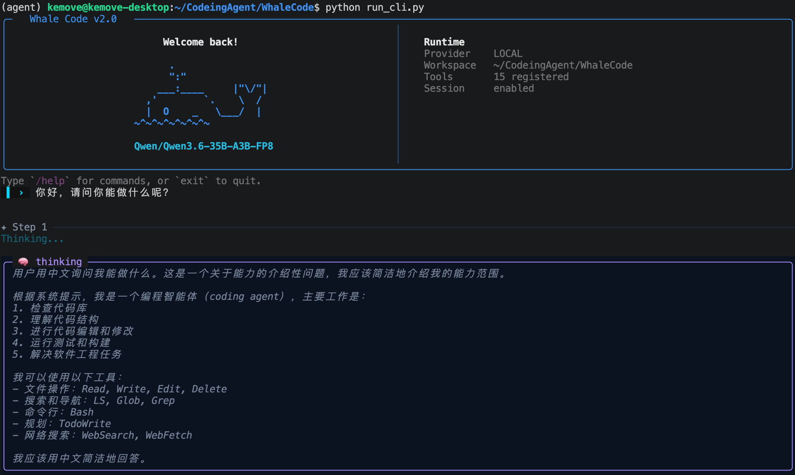

<div align="center">

# 🐋 Whale Code

### A Production-Grade Coding Agent Framework

[](https://www.python.org/)
[](LICENSE)
[]()
[]()

</div>

---

> **Whale Code** is a from-scratch implementation of an autonomous coding agent that operates inside a local repository. It follows the **ReAct (Reasoning + Acting)** paradigm, powered by OpenAI-compatible function calling, and ships with a full suite of atomized programming tools, a multi-layer context management engine, and a persistent task scheduling system.
>
> The goal is to replicate — and deeply understand — the core architecture behind tools like Claude Code, Cursor Agent, and similar AI coding assistants.

<div align="center">



</div>

The agent follows a strict **Think → Act → Observe → Re-think** loop implemented through the ReAct pattern. Every reasoning step, tool invocation, and observation is tracked, compressed, and persisted.

---

## ✨ Key Features at a Glance

| Feature | Description |
|---------|-------------|
| 🧠 **ReAct Loop** | Structured Think → Act → Observe → Re-think cycle via OpenAI function calling — no fragile text parsing |
| 🔧 **Atomized Tools** | 23 specialized tools across 8 categories — Git, LSP, file ops, search, execution — all with typed `ToolResponse` |
| 🎭 **Multi-Agent Orchestra** | LLM-driven task decomposition → role-based parallel sub-agents → structured result aggregation |
| 🔍 **Code Review Agent** | Automated PR/code review with multi-lens verification, severity ranking, and structured findings |
| 🗜️ **Three-Layer Compact** | micro / auto / manual context compaction keeps long sessions manageable |
| 📋 **Persistent Task System** | TodoWrite with atomic JSON snapshots — plans survive compaction and session resume |
| 🛡️ **Sandbox Safety** | Static + runtime guards for benchmark execution; circuit breaker for failing tools |
| 📊 **Benchmark Suite** | Built-in evaluation on HumanEval+, ClassEval, AIME, LiveCodeBench & SWE-bench |

---

## 📑 Table of Contents

- [🚀 Quick Start](#-quick-start)
  - [Installation](#installation)
  - [Running the Agent](#running-the-agent)
  - [Slash Commands](#slash-commands)
- [🏗️ Architecture Overview](#️-architecture-overview)
- [🤖 CodeAgent Implementation Details](#-codeagent-implementation-details)
- [🎭 Multi-Agent Orchestration](#-multi-agent-orchestration)
  - [AgentOrchestra — Decompose & Execute](#agentorchestra--decompose--execute)
  - [Role System — Explorer / Reviewer / Tester](#role-system--explorer--reviewer--tester)
  - [Code Review with Structured Findings](#code-review-with-structured-findings)
- [🗜️ Context Management](#️-context-management)
- [🔧 Atomized Tool System](#-atomized-tool-system)
  - [Why Atomized Tools Instead of Bash?](#why-atomized-tools-instead-of-bash)
  - [Tool List](#tool-list)
  - [Tool Response Protocol](#tool-response-protocol)
  - [Circuit Breaker](#circuit-breaker)
- [💥 Bash Tool](#-bash-tool)
- [📋 Task System](#-task-system)
  - [Unified Task Management (TodoWrite)](#unified-task-management-todowrite)
  - [Background Execution via Bash](#background-execution-via-bash)
- [🧪 Benchmark Sandbox](#-benchmark-sandbox)
- [📊 Benchmarks](#-benchmarks)
  - [Supported Benchmarks](#supported-benchmarks)
  - [Quick Start](#quick-start-1)
  - [Results](#result)
- [📄 License](#-license)

---

## 🚀 Quick Start

### Installation

```bash
# 1. Clone the repository
git clone https://github.com/ZenoAFfectionate/Coding_Agent.git
cd Whale_Code

# 2. Create and activate a conda virtual environment
conda create -n WhaleCode python=3.12 -y
conda activate WhaleCode

# 3. Install dependencies
pip install -r requirements.txt

# 4. Configure `.env` (minimum required):
#    LLM_MODEL_ID=<your-model>
#    LLM_API_KEY=<your-key>
#    LLM_BASE_URL=<your-openai-compatible-endpoint>
```

### Running the Agent

<details>
<summary><b>🖥️ Start the vLLM backend (click to expand)</b></summary>

```bash
CUDA_VISIBLE_DEVICES=2 vllm serve Qwen/Qwen3.6-35B-A3B-FP8 \
    --port 8000 \
    --max-model-len 262144 \
    --max-num-seqs 2 \
    --gpu-memory-utilization 0.95 \
    --reasoning-parser qwen3 \
    --tool-call-parser qwen3_coder \
    --language-model-only \
    --enable-auto-tool-choice
```

</details>

```bash
# Launch the interactive CLI
python run_cli.py --workspace /working/space
```

The CLI provides an interactive loop where you can issue coding tasks:

```
> Read the main entry point and summarize its structure
> Find all TODO comments in the codebase
> Add error handling to the data processing pipeline
```

<div align="center">



</div>

### Slash Commands

| Command | Description |
|:--------|:------------|
| `/help` | Show the help message with all available commands |
| `/info` `/model` | Display runtime info: workspace path, model, base URL, temperature, trace status, tool count |
| `/tools` | List all registered tools with their descriptions |
| `/pwd` | Print the current working directory |
| `/cd <path>` | Change the agent's working directory (must stay within workspace root) |
| `/history [n]` | Show conversation history; optional `n` limits to the last N entries |
| `/log` | Open all terminal output in a scrollable pager (`less`/`more`) |
| `/clear` | Clear the in-memory conversation history |
| `/save [name]` | Save the current session snapshot (default name: `session-latest`) |
| `/load [path\|name]` | Load a previously saved session by file path or name |
| `/resume [path\|name]` | Alias of `/load`; restores conversation + task snapshot |
| `/sessions` | List all saved session files with metadata (steps, tokens, timestamps) |
| `/compact [focus]` | Manually trigger context compaction; optional `focus` guides the summary |

---

## 🏗️ Architecture Overview

> **Design Philosophy**
>
> Whale Code is organized around one goal: **make a coding agent reliable enough to work inside a real repository**. The core system is intentionally simple in concept — a function-calling ReAct loop plus safe tools. The engineering focus is on *context durability*, *controlled shell execution*, *persistent task state*, and *benchmark-safe evaluation*.

Whale Code builds a coding-specialized agent on top of the HelloAgent framework:

```
Agent base  →  ReActAgent (function-calling loop)  →  CodeAgent (repository-aware coding agent)
```

The agent follows a strict **Think → Act → Observe → Re-think** workflow:

| Step | Phase | Description |
|:----:|:------|:------------|
| 1️⃣ | **Think** | The model analyzes the task and decides what information or action is needed. |
| 2️⃣ | **Act** | The model calls structured tools through OpenAI-compatible function calling. |
| 3️⃣ | **Observe** | Tool results come back as typed `ToolResponse` objects instead of raw text only. |
| 4️⃣ | **Re-think** | The model updates its plan from the observation and continues until it can finish. |

> 💡 **Why structured function calling?**
>
> This avoids fragile text-parsed ReAct formats such as `Action: ...`, because tool calls are structured JSON. That makes the loop easier to **validate**, **trace**, **compact**, and **recover from**.

---

## 🤖 CodeAgent Implementation Details

> **Source**: `code/agents/code_agent.py`

CodeAgent adds **repository awareness** and **coding-specific behavior** to the generic ReAct loop:

| Feature | Description |
|---------|-------------|
| 📂 **Workspace boundary** | Each agent is initialized with `project_root` and `working_dir`; file-oriented tools must stay inside that root. |
| 📝 **Coding system prompt** | `code/prompts/system_prompt.md` teaches the model to inspect before editing, prefer specialized tools over raw shell commands, use TodoWrite for multi-step work, and verify changes when possible. |
| 🔧 **Default tool registration** | `CodeAgent.register_default_tools()` wires the core coding tools into one `ToolRegistry`. |
| ⏱️ **Finite step budget** | The default coding loop is bounded, preventing runaway tool-call loops. |
| 🔒 **Sub-agent isolation** | Sub-agents receive separate registries and history, with interactive `AskUser` disabled for delegated work. Read-only tools (`GitStatus`, `GitDiff`, `GitBlame`, `GitLog`, `Glob`, `Grep`) are auto-filtered for explore/plan/review sub-agents via category-based `ToolFilter`. |

**A typical coding task flow:**

```
User task
  │
  ▼
CodeAgent builds a workspace-aware prompt
  │
  ▼
Search & Read tools inspect the repository
  │
  ▼
TodoWrite records the active plan (if multi-step)
  │
  ▼
Edit / Write / Bash → implementation & verification
  │
  ▼
HistoryManager + compaction keep long-running context usable
  │
  ▼
Agent returns a concise engineering handoff
```

---

## 🎭 Multi-Agent Orchestration

> **Source**: `code/agents/orchestra.py`, `code/agents/roles/`, `code/agents/review_agent.py`

The single CodeAgent excels at focused tasks, but real-world engineering work often spans **exploration → implementation → review → testing** — phases with different skill requirements and safety constraints. Whale Code introduces an **orchestrator-worker** pattern to decompose complex tasks and execute them through role-specialized sub-agents in parallel.

### AgentOrchestra — Decompose & Execute

The orchestra pipeline has four stages:

```
┌──────────────┐    ┌──────────────┐    ┌──────────────────┐    ┌──────────────┐
│  Decompose   │ →  │    Plan      │ →  │  Parallel Exec   │ →  │  Aggregate   │
│  (LLM)       │    │  (topo sort) │    │  (Semaphore N)   │    │  (LLM)       │
└──────────────┘    └──────────────┘    └──────────────────┘    └──────────────┘
```

| Stage | Description |
|:------|:------------|
| 🔀 **Decompose** | LLM breaks the user task into subtasks with role assignments (`explorer` / `reviewer` / `tester`) and dependency edges. |
| 📊 **Plan** | Topological sort resolves execution stages. Subtasks with satisfied dependencies run concurrently within each stage. |
| ⚡ **Execute** | Role-specialized sub-agents run in parallel with `asyncio.Semaphore` throttling. Upstream results are injected as `context_hint` into dependent subtasks. |
| 🧩 **Aggregate** | LLM synthesizes all sub-agent outputs into a coherent final response. |

Key design decisions:

| Decision | Rationale |
|:---------|:----------|
| **Stage-parallel, not fully-parallel** | Dependencies matter — exploration must complete before code changes; reviews must see final diffs. Topological staging lets independent work fan out while respecting order. |
| **Semaphore throttling** | Prevents explosion of concurrent LLM calls when the task DAG has high fan-out. |
| **Timeout → graceful degrade** | Python thread-pool tasks can't be killed; timed-out sub-agents are discarded and their results excluded from aggregation rather than crashing the whole run. |
| **Full isolation** | Each sub-agent gets a cloned `ToolRegistry`, separate history, and `AskUser` disabled. This prevents accidental cross-contamination and keeps interactive prompts contained. |

### Role System — Explorer / Reviewer / Tester

Roles are pre-configured sub-agent profiles that control **system prompt**, **tool availability**, and **behavior**:

| Role | Category | Tools | Purpose |
|:-----|:---------|:------|:--------|
| 🔍 **Explorer** | `readonly` | Glob, Grep, Read, LS, GitStatus, GitDiff, GitLog, GitBlame, Bash (restricted) | Understand codebase structure, trace dependencies, locate relevant code |
| 📝 **Reviewer** | `readonly` | Glob, Grep, Read, LS, GitDiff, GitLog, GitBlame, Bash (restricted) | Multi-lens code review: correctness, security, performance, idiomatic style |
| 🧪 **Tester** | `write` | Read, Write, Edit, Bash, GitDiff | Write and run tests, verify fixes |

> 💡 **Why roles instead of one generic sub-agent?** Different phases have different safety profiles. An explorer should never edit files; a reviewer needs structured output templates; a tester needs write access. Role-based dispatch keeps these boundaries explicit and enforceable via `ToolFilter` rather than relying on prompt instructions alone.

### Code Review with Structured Findings

The **Reviewer role** (`ReviewerRole`) and standalone **ReviewAgent** provide automated code review with:

- 📌 **Multi-lens analysis** — correctness, security, performance, and style each checked independently
- 🏷️ **Severity ranking** — `critical` / `high` / `medium` / `low` / `info` with concrete failure scenarios
- ✅ **Adversarial verification** — findings pass through a second pass to reduce false positives
- 📋 **Structured output** — `ReviewFinding` and `ReviewReport` with line-anchored, machine-readable results
- 🔄 **PR integration** — `review_pr()` and `review_diff()` accept git refs or raw diffs, process through `git diff --stat` → focused review → report aggregation

> 🛡️ The reviewer sees only `readonly` tools — it cannot modify code, only report findings. This makes it safe to run automatically on every commit or PR.

---

## 🗜️ Context Management: Three-Layer Compact

Long-running coding tasks quickly produce large tool outputs, repeated observations, and stale intermediate reasoning. Whale Code keeps context manageable through a **three-layer compact system**.

### Layer 1: `micro_compact` 🔄

| | |
|---|---|
| **Trigger** | Every turn, before the next model call. |
| **Purpose** | Reduce old tool-result noise while preserving the most recent execution evidence. |

**How it works:**

- Scans tool messages from **newest to oldest**.
- Keeps the **most recent** tool results intact.
- Replaces older tool outputs with compact placeholders, for example:
  - `Previous tool result: Grep - truncated`
  - `Previous tool result: Bash - truncated`
- Uses a `tool_call_id → tool_name` map so truncation notes remain meaningful.

> ⚡ This layer is **cheap and frequent**. It prevents large observations from dominating the next prompt while keeping the working sequence understandable.

### Layer 2: `auto_compact` 🤖

| | |
|---|---|
| **Trigger** | Token usage crosses the configured threshold. |
| **Purpose** | Rebuild an overgrown conversation into a concise state summary. |

**How it works:**

1. Saves the **full transcript** before compression.
2. Serializes messages in OpenAI function-calling format.
3. Calls the LLM to produce a structured summary of: completed work, current state, important files, decisions, unresolved issues, and still-relevant tool outputs.
4. Rebuilds active history as:

```
┌─────────────────────┐
│   system prompt      │
├─────────────────────┤
│   compact summary    │
├─────────────────────┤
│   recent rounds      │
└─────────────────────┘
```

> 🛡️ This is the **main safety valve** for long coding sessions.

### Layer 3: `manual_compact` ✋

| | |
|---|---|
| **Trigger** | Explicit user or CLI request, e.g. `/compact focus-on-authentication` |
| **Purpose** | Let the user or operator compress the session around a specific topic. |

**How it works:**

- Uses the same summarization path as `auto_compact`.
- Accepts an optional **focus string**.
- Prioritizes context relevant to that focus while retaining recent working state.

> 🎯 Useful after a large exploration phase, before switching to implementation, debugging, or final verification.

### 📦 Related Context Components

| Component | Source | Responsibility |
|-----------|--------|----------------|
| `HistoryManager` | `code/context/history.py` | Stores append-only messages, detects round boundaries, estimates token pressure, performs compaction. |
| `TokenCounter` | `code/context/token_counter.py` | Local token estimation with caching — avoids repeated full-history recounts. |
| `ObservationTruncator` | `code/context/truncator.py` | Handles oversized tool outputs with head/tail previews and full-output persistence. |
| `ContextBuilder` | `code/context/builder.py` | GSSC-style pipeline: **G**ather → **S**elect → **S**tructure → **C**ompress context packets. |

---

## 🔧 Atomized Tool System

Whale Code intentionally uses **specialized tools** instead of relying on one unrestricted Bash interface. Beyond the classic file/search/execution tools, this principle extends to **native Git integration** and **LSP-powered code intelligence** — operations where parsing raw terminal output would be fragile and token-inefficient.

### Why Atomized Tools Instead of Bash?

A Bash-only agent can run `cat`, `grep`, `sed`, `rm`, or arbitrary shell pipelines, but that makes safety and recovery harder. Whale Code splits file, search, planning, web, and execution operations into dedicated tools so each operation can enforce its own contract:

| Guarantee | How it works |
|-----------|--------------|
| 🔐 **Path safety** | File tools resolve paths against `project_root`. |
| 🔒 **Optimistic locking** | `Read` returns file metadata that `Write` and `Edit` can check before mutation. |
| 📋 **Structured errors** | Failures return typed error codes instead of only `stderr`. |
| ⚡ **Circuit breaker** | Repeatedly failing tools are temporarily disabled. |
| 📉 **Context efficiency** | Tool responses are designed for LLM consumption instead of raw terminal output. For example, `GitDiff` returns structured `{files: [{path, status, additions, deletions, patch}]}` — one token-efficient object instead of screenfuls of raw unified diff text. |

### Tool List

| Category | Tool | Description |
|:---------|:-----|:------------|
| 📁 **File Discovery** | `Glob` | Find files by glob pattern (e.g. `**/*.py` or `src/**/*.ts`) with directory pruning |
| | `Grep` | Regex code search using `ripgrep` with Python fallback |
| | `LS` | List directory contents inside the workspace |
| | `Read` | Read file content with line numbers and optimistic-lock metadata |
| ✏️ **File Modification** | `Write` | Full-file rewrite or creation with atomic write, dry-run support, and optimistic locking |
| | `Edit` | Single-snippet replacement with conflict detection, diff preview, and backup |
| | `Delete` | Safe deletion with protected-path checks and trash-style recovery behavior |
| ⚙️ **Execution** | `Bash` | Run non-interactive commands with policy validation, resource limits, and background terminal tracking |
| 📋 **Planning** | `TodoWrite` | Session-scoped replace-all task manager with one active task and atomic snapshots |
| 🌐 **Web** | `WebSearch` | Search the web when enabled |
| | `WebFetch` | Fetch and extract readable web content when enabled |
| 🐙 **Git** | `GitStatus` | Structured `git status --porcelain=v2` with branch, staged/unstaged/untracked/conflict info and stash count |
| | `GitDiff` | Structured diff (numstat + name-status + unified patch) between worktree, index, or arbitrary commits |
| | `GitLog` | Structured commit history with author, date, message, and changed files |
| | `GitBlame` | Line-level authorship with `--porcelain` parsing |
| | `GitCommit` | Safe commit wrapper: auto-message generation, `--amend`/`--no-verify` guard, empty-staging protection |
| 📐 **LSP** | `LSPDefinition` | Go-to-definition via LSP — locate symbol declarations with line/column precision |
| | `LSPReferences` | Find all references to a symbol across the codebase |
| | `LSPHover` | Hover-type information: docstrings, type signatures, inferred types |
| | `LSPDiagnostics` | Compiler/linter diagnostics: errors, warnings, hints for the current file |
| 💬 **Interaction** | `AskUser` | Ask a clarifying question in the main interactive agent only |
| 🎛️ **Control** | `Thought` | Record concise reasoning inside the structured ReAct loop |
| | `Finish` | End a run explicitly when benchmark or structured-output mode requires it |

### Tool Response Protocol

All tools return a `ToolResponse` object with the following fields:

| Field | Type | Description |
|:------|:-----|:------------|
| `status` | enum | `SUCCESS`, `PARTIAL`, or `ERROR` |
| `text` | string | Human and LLM-readable observation |
| `data` | object | Structured payload |
| `error_info` | object | Machine-readable error details |
| `stats` | object | Timing and execution metadata |

### Circuit Breaker

Tools that repeatedly fail are **temporarily disabled** by the circuit breaker mechanism, preventing the agent from getting stuck in a loop of failing tool calls. Once cooled down, the tool becomes available again.

---

## 💥 Bash Tool

> **Source**: `code/tools/builtin/bash.py`

Bash is reserved for operations that genuinely require command execution: **tests, builds, formatters, package commands, scripts, and benchmark helpers**. It is *not* meant to replace `Read`, `Grep`, `Glob`, `Edit`, or `Delete`.

### Command Policy

The Bash tool actively nudges the model toward safer tools:

- 🚫 Standalone `ls`, `find`, `grep`, `rg`, `sed`, and `awk` are **rejected** when a specialized tool should be used.
- ✅ Piped usage is still **allowed** when the command is part of a larger shell workflow.
- ⚠️ Destructive patterns such as unsafe root deletion are **detected**.
- 📂 Each command runs in an explicit working directory; shell `cd` does **not** persist across calls.

### Background Execution

Long-running commands are handled inside the same tool:

```
┌──────────────────────────────────────────────┐
│  1. block_until_ms waits for the command     │
│     for a configured window                  │
│                                              │
│  2. If still running → background tracking   │
│     block_until_ms: 0 → immediate background  │
│                                              │
│  3. Output captured as timestamped events     │
│                                              │
│  4. Terminal artifacts written to             │
│     memory/terminals/                         │
│     ├── human-readable snapshot files         │
│     └── machine-readable event stream files   │
│                                              │
│  5. Old artifacts cleaned; stale records      │
│     reconciled on startup                     │
└──────────────────────────────────────────────┘
```

> 💡 This removes the need for a separate background-task tool while preserving **live feedback** for long builds or evaluations.

### Runtime Hardening

Bash execution **strips secret-looking environment variables** and applies **resource limits** where supported. This reduces the blast radius of prompt-injected or model-generated shell commands.

---

## 📋 Task System

### Unified Task Management (TodoWrite)

> **Source**: `code/tools/builtin/todowrite_tool.py`

TodoWrite is the **planning backbone** for non-trivial coding tasks. Instead of accumulating vague conversation notes, the model maintains one explicit task-state object.

#### Design

TodoWrite uses a **replace-all** interface. Each call submits the complete current plan:

```yaml
todos:
  - content: Inspect file tools
    status: completed
  - content: Update Bash policy tests
    status: in_progress
  - content: Run verification
    status: pending
```

#### Rules

| Rule | Detail |
|:-----|:-------|
| **Full plan** | The submitted `todos` array represents the complete current plan. |
| **Single active** | At most **one** item may be `in_progress`. |
| **No duplicates** | Duplicate tasks are rejected. |
| **Terminal states** | `completed` and `cancelled` tasks are terminal. |
| **Persistence** | State is stored as an atomic JSON snapshot under `memory/todos/session-id.json`. |
| **Session restore** | Saved sessions embed todo state, so `/load` and `/resume` restore the active plan. |

#### Why It Matters

TodoWrite gives the model **durable task memory** across:

- 🗣️ long conversations,
- 🗜️ context compaction,
- 💾 CLI saves and resumes,
- 🔧 multi-step implementation and verification.

The result is a simpler tool contract for the model and a clearer progress surface for the user.

### Background Execution via Bash

See the [Bash Tool — Background Execution](#background-execution) section above for details on how long-running commands are tracked.

---

## 🧪 Benchmark Sandbox

Benchmark evaluation runs **untrusted model-generated code**. Whale Code therefore separates normal repository work from benchmark execution and applies additional sandbox controls.

<details>
<summary><b>📂 Primary source files (click to expand)</b></summary>

| File | Purpose |
|------|---------|
| `code/benchmark/base.py` | Base benchmark infrastructure |
| `code/benchmark/runtime/python_env.py` | Python runtime environment |
| `code/benchmark/runtime/python_adapters.py` | Dataset-specific evaluation adapters |
| `code/benchmark/safe_exec.py` | Safe execution sandbox |

</details>

### Controlled Submission Loop

Benchmarks can run multiple controlled rounds:

```
agent submits candidate
  │
  ▼
sandbox evaluates candidate
  │
  ▼
structured feedback is generated
  │
  ▼
feedback is injected into the next prompt
  │
  ▼
agent retries within a fixed budget  ←─────┐
  │                                       │
  └───────────────────────────────────────┘
```

> 🔄 This turns evaluation from a one-shot answer into an **iterative repair loop** while still keeping each attempt bounded.

### Adapter Layer

Different datasets expose different evaluation formats. Whale Code normalizes them through Python adapters:

| Adapter | Used for | Evaluation style |
|:--------|:---------|:-----------------|
| `PythonAssertionAdapter` | MBPP-style tasks | Run generated code against assertion checks |
| `PythonVerifierAdapter` | HumanEval+ / ClassEval-style hidden checks | Build and execute a combined verifier |
| `PythonStdinAdapter` | stdin/stdout programming tasks | Feed input text and compare output |
| `PythonFunctionalAdapter` | function-call benchmarks | Invoke target functions through helper code |

### Two-Layer Safety Model

The benchmark sandbox combines **static validation** with **bounded subprocess execution**.

#### 1️⃣ Static Python Safety Checks

Before execution, benchmark code is scanned for dangerous patterns. The checker blocks high-risk imports and calls such as:

- 🚫 Process and shell escape modules
- 🌐 Networking primitives
- 📦 Dynamic import helpers
- ⚠️ Unsafe serialization or native-interface modules
- 💀 Direct execution helpers such as `eval`, `exec`, or unsafe import paths

> ⚠️ **Note**: The goal is not to prove arbitrary code safe. The goal is to **reject common dangerous model outputs** before they reach execution.

#### 2️⃣ Bounded Subprocess Runtime

Accepted code runs in a controlled subprocess environment:

| Control | Description |
|:--------|:------------|
| 🔀 **Isolation** | Separate process session and process group |
| ⏱️ **Timeout** | Timeout enforcement with process-group kill |
| 🌍 **Minimal env** | Minimal child environment; secret-looking env vars removed |
| 📊 **Resource limits** | CPU, memory, process-count, and file-size limits where supported |
| 💾 **Artifacts** | Evaluation artifacts persisted for debugging and feedback |

**`BenchmarkRuntimeConfig`** exposes these limits through environment variables:

| Environment Variable | Controls |
|:---------------------|:---------|
| `WHALE_BENCH_EVAL_CPU_SECONDS` | CPU time limit |
| `WHALE_BENCH_EVAL_MEMORY_BYTES` | Memory limit |
| `WHALE_BENCH_EVAL_MAX_PROCESSES` | Max process count |
| `WHALE_BENCH_EVAL_FILE_SIZE_BYTES` | Max file size |
| `WHALE_BENCH_EVAL_ARTIFACT_RETENTION` | Artifact retention policy |

### Artifact and Feedback Design

Sandbox execution records useful artifacts instead of dumping unbounded logs into the prompt:

| Artifact | Description |
|:---------|:------------|
| `source` | Source submitted for evaluation |
| `stdout` / `stderr` | Excerpted standard output and error |
| `status` | Execution status and return code |
| `timing` | Timeout and elapsed time |
| `limits` | Sandbox limit metadata |
| `paths` | Artifact paths for deeper inspection |

> 📋 Feedback injected into the next round is **clipped and structured** so the agent sees the actionable failure without flooding context.

---

## 📊 Benchmarks

Whale Code includes a built-in benchmark suite to evaluate the coding agent on **five standard datasets**. All benchmarks use `CodeAgent` with its full tool set (`Read`, `Write`, `Edit`, `Bash`, `Glob`, `Grep`, etc.) — web-related tools are **disabled** during evaluation to ensure fair, reproducible results.

> **Source**: `code/benchmark/`

### Supported Benchmarks

| Benchmark | Dataset | Tasks | Metric | Description |
|:----------|:--------|------:|:-------|:------------|
| **MBPP+** | `data/MBPP/` | 378 | pass@1 | Crowd-sourced Python programming problems |
| **HumanEval+** | `data/HEVP/` | 164 | pass@1 | Function-generation tasks with 80× more tests than original HumanEval |
| **ClassEval** | `data/CLEV/` | 100 | pass@1 | Class-level code generation requiring multi-method implementation |
| **AIME** | `data/AIME/` | — | accuracy | Math competition problems solved via agent-written Python programs |

> 📌 **Note on SWE-bench**: SWE-bench uses a **two-phase evaluation**:
>
> 1. **Phase 1 — Agent inference** (`run_swev.sh`): The agent reads the issue, navigates the repo, and produces a patch (git diff). Results are saved as a predictions JSONL file.
> 2. **Phase 2 — Docker evaluation** (`run_swev_eval.sh`): The predictions are fed to the [official SWE-bench Docker harness](https://github.com/SWE-bench/SWE-bench) which applies each patch in an isolated container with the correct Python version and dependencies, then runs the test suite to grade the fix.

### Quick Start

> ⚠️ **Prerequisite**: The LLM backend must be running (e.g. vLLM, or set the API key in `.env`).

```bash
# Run individual benchmarks
bash scripts/run_aime.sh    # AIME benchmark
bash scripts/run_hevp.sh    # HumanEval benchmark
bash scripts/run_clev.sh    # ClassEval benchmark
bash scripts/run_lcb6.sh    # LiveCode benchmark

# ── SWE-bench Verified ──────────────────────────────────────
# Phase 1: Agent inference
bash scripts/run_swev.sh --limit 5 --workers 2

# Phase 2: Docker evaluation
bash scripts/run_swev_eval.sh data/_results/swev_predictions_YYYYMMDD_HHMMSS.jsonl
```

<details>
<summary><b>📤 SWEV phase-1 output files (click to expand)</b></summary>

| File | Format | Description |
|:-----|:-------|:------------|
| `swev_predictions_<timestamp>.jsonl` | JSONL | Official harness format |
| `swev_preds_<timestamp>.json` | JSON | Dictionary format, compatible with SWE-agent style tooling |
| `preds.json` | JSON | Latest predictions snapshot (overwritten each run) |

</details>

<details>
<summary><b>🐛 Common <code>CalledProcessError</code> root causes in Docker runs (click to expand)</b></summary>

1. `docker info` fails — daemon not running / permission issue.
2. Image pull/start fails — network, registry rate limit, image not found, architecture mismatch.
3. `git clone`/`git checkout` fails — bad commit hash, network failure, corrupted repo cache.

> The SWEV runner now records richer diagnostics (command, return code, stdout/stderr excerpt) in failure messages to make these issues actionable.

</details>

### Result

> 🤖 **Model**: Qwen3.6-35B-A3B-FP8 &nbsp;|&nbsp; **Speed**: 100 tokens/s on 4090D-48G

| Benchmark | Tasks | Passed | Pass Rate | Avg Time | Date |
|:----------|------:|-------:|----------:|---------:|:-----|
| **AIME 24** | 30 | 28 | **93.3%** | 75s | 2026-07-27 |
| **AIME 25** | 30 | 29 | **96.7%** | 170s | 2026-07-27 |
| **AIME 26** | 30 | 28 | **93.3%** | 142s | 2026-07-27 |
| **HumanEval+** | 164 | 162 | **98.8%** | 25s | 2026-07-27 |
| **ClassEval** | 100 | 91 | **91.0%** | 233s | 2026-07-27 |
| **LiveCodeBench** | 175 | 122 | **69.7** | 742s | 2026-07-27 |
| **SWE-verified** | 500 | — | — | — | — |

> 🤖 **Model**: Deepseek-v4-flash-0731 &nbsp;|&nbsp; **Speed**: xx tokens/s from API

| Benchmark | Tasks | Passed | Pass Rate | Avg Time | Date |
|:----------|------:|-------:|----------:|---------:|:-----|
| **AIME 24** | 30 | 30 | **100.0%** | 53s | 2026-08-09 |
| **AIME 25** | 30 | 30 | **100.0%** | 61s | 2026-08-09 |
| **AIME 26** | 30 | 30 | **100.0%** | 71s | 2026-08-09 |
| **HumanEval+** | 164 | 163 | **99.4%** | 21s | 2026-08-09 |
| **ClassEval** | 100 | 97 | **97.0%** | 226s | 2026-08-09 |
| **LiveCodeBench** | 175 | 157 | **89.7%** | 304s | 2026-08-09 |
| **SWE-verified** | 500 | — | — | — | — |

---

## 📄 License

This project is licensed under [**CC-BY-NC-SA-4.0**](LICENSE).

---

<div align="center">

<sub>Built with ❤️ as a deep-dive into autonomous coding agent architecture.</sub>

</div>
